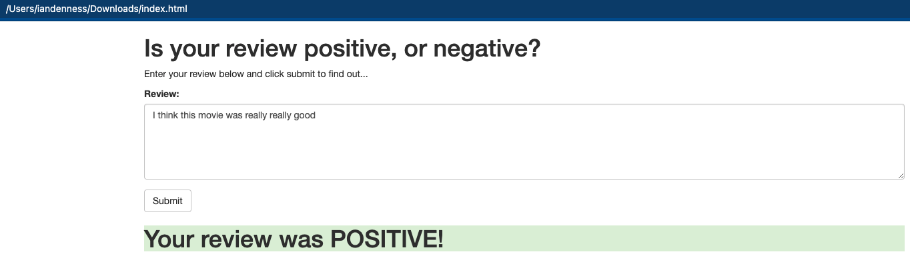

# SageMaker Deployment Project

The notebook and Python files provided here, result in a simple web app which interacts with a AWS hosted and deployed recurrent neural network performing sentiment analysis on movie reviews. This project assumes requires familiarity with SageMaker, Udacity the mini-projects, Sentiment Analysis using XGBoost, 

The end state is a locally hosted webpage that looks like the below image.

Figure 1 - Postive Sentiment Review 

# Implementation

There are sample files available at the below github account that provide the baseline code.

Please see the [README](https://github.com/udacity/sagemaker-deployment/tree/master/README.md) in the root directory for instructions on setting up a SageMaker notebook and downloading the project files (as well as the other notebooks).

# General Outline

1. Download or otherwise retrieve the data.
2. Process / Prepare the data.
3. Upload the processed data to S3.
4. Train a chosen model.
5. Test the trained model (typically using a batch transform job).
6. Deploy the trained model.
7. Use the deployed model.

